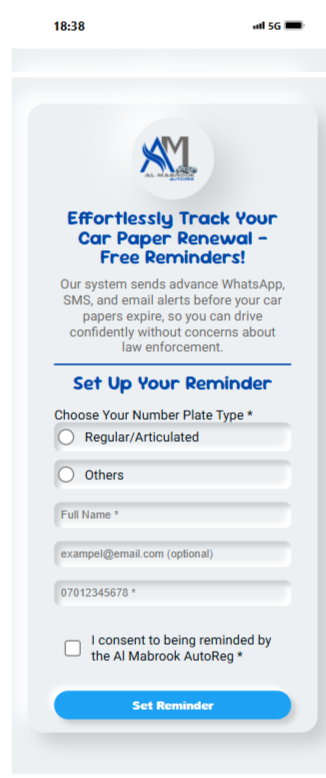

# Car Document Renewal Reminder | Al Mabrook AutoReg

## Table of contents

- [Overview](#overview)
  - [About the project](#about-the-project)
  - [Screenshot](#screenshot)
  - [Links](#links)
- [My process](#my-process)
  - [Built with](#built-with)
  - [What I learned](#what-i-learned)
  - [Continued development](#continued-development)
- [Author](#author)
- [Acknowledgments](#acknowledgments)

## Overview

### About the project

The _Renewal Reminder Form_ is a responsive, user-friendly web form designed to
assist users in submitting plate renewal information efficiently. It dynamically
adjusts input fields based on the selected plate type and ensures data integrity
through comprehensive validations, providing immediate feedback to users. The
project integrates seamlessly with Supabase, and Mailjs to streamline data
processing and notifications.

### Screenshot


.png>)

### Links

- GITHUB URL:
  [GitHub Repo](https://github.com/Mubarak-Adeyemi/Al-Mabrook-AutoReg-RE-Form)
- Live Site URL:
  [Live Site](https://mubarak-adeyemi.github.io/Al-Mabrook-AutoReg-RE-Form/)

## My process

### Built With

- **HTML5:** For structuring the form layout and ensuring semantic, accessible
  markup.
- **CSS3:** Used for styling the form, leveraging modern features such as custom
  properties (`:root`) and media queries for responsiveness.
- **JavaScript (ES6):** Handles form interactivity, input validations, and
  dynamic field management.
- **Supabase:** Provides serverless backend functionality for form data storage.
- **Mail.js:** Enables email notifications to be sent upon form submission.

---

### What I Learned

- **Dynamic Field Management:** Gained expertise in dynamically showing and
  hiding form sections based on user input using JavaScript.
- **Advanced Validation:** Applied regex patterns for robust validation of
  names, email addresses, and phone numbers.
- **Responsive Design Principles:** Enhanced understanding of how to make forms
  adapt seamlessly across devices using CSS and media queries.
- **Supabase Integration:** Implementing Supabase for seamless data storage and
  integration with third-party services like emailjs for notifications.

- **Error Handling:** Built reusable functions to display and clear error
  messages for an improved user experience.

---

### Some Insightful Snippets

1. **Dynamic Fieldset Display**

   ```js
   const displayFieldset = (fieldset, hiddenClass) => {
     fieldset.classList.remove(hiddenClass);
     fieldset.setAttribute("aria-hidden", "false");
   };
   const hideFieldset = (fieldset, hiddenClass) => {
     fieldset.classList.add(hiddenClass);
     fieldset.setAttribute("aria-hidden", "true");
   };
   ```

   This modular approach keeps the form clean and accessible while toggling
   fieldsets.

2. **Validation Example for Full Name**

   ```js
   const validateFullnameInput = () => {
     const namePattern =
       /^[A-Za-z]+(?:[-'][A-Za-z]+)?(?:\s[A-Za-z]+(?:[-'][A-Za-z]+)?)+$/;
     if (!namePattern.test(fullNameInput.value)) {
       displayError(errors.fullNameError, "Please input a valid Full name");
       return false;
     }
     return true;
   };
   ```

   This regex ensures accurate validation of names, accounting for spaces,
   hyphens, and apostrophes.

3. **Success Message Timeout**
   ```js
   const displaySuccessMessage = () => {
     successMessage.classList.remove("hidden");
     const timeout = setTimeout(() => hideSuccessMessage(), 5000);
     successMessage.addEventListener("click", () => {
       hideSuccessMessage();
       clearTimeout(timeout);
     });
   };
   ```
   This snippet creates a smooth and dismissible success message for user
   feedback.

---

### Continued Development

- **Accessibility Enhancements:** Include ARIA roles and labels for even better
  screen reader compatibility.
- **Database Integration:** Transition from Supabase to a dedicated database for
  scalable data management.

- **Styling Upgrades:** Add animation effects and refine design for an even more
  polished user experience.
- **Deployment Automation:** Explore CI/CD pipelines to automate updates and
  deployments.

## Author

- Frontend Mentor -
  [Mubarak-Adeyemi](https://www.frontendmentor.io/profile/Mubarak-Adeyemi)
- Twitter - [@mubarakElarabiy](https://www.twitter.com/@mubarakElarabiy)
- LinkedIn - [Mubarak-dhikrullah]
  (https://www.linkedin.com/in/mubarak-dhikrullah-119731206?utm_source=share&utm_campaign=share_via&utm_content=profile&utm_medium=android_app
  )

## Acknowledgments

All praise and gratitude are due to Allah, the Creator, for granting me the
knowledge, strength, and ability to complete this project.

I extend my heartfelt appreciation to:

- **Mr. Oluwasheun:** for introducing to Supabase and Mailjs and your guidance
  on their application, which greatly improved the functionality of this
  project.
- **Mr.Malik:** for his thoughtful advice and guidance, which were instrumental
  in refining the form’s design and functionality.
- **Umu Hannan:** for her unwavering encouragement and motivation, which fueled
  my determination to see this project to completion.

Their contributions and support have been invaluable in making this
project a success.
